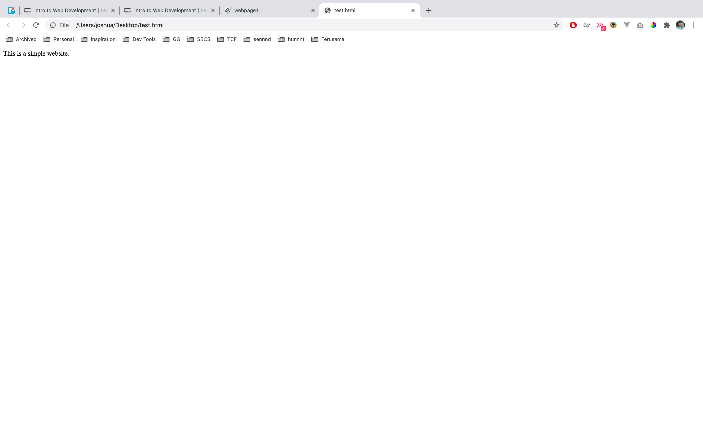

# Intro to HTML

## Overview

At the end of this lesson, you will be know what HTML is, how it fits into
websites, and how to use it.

## Topics

1. What is HTML
2. HTML's place in a website
3. Basic HTML
4. Advanced HTML

### 1. What is HTML

HTML stands for HyperText Markup Language (don't worry about memorizing this). It is a necessary part of any website (and technically the only part is absolutely necessary). An example of a very simple HTML file could have code that looks like this:
```
<html>
  <head></head>
  <body>
    This is a simple website.
  </body>
</html>
```

Which would result in a webpage that looks like:



Wow. What a beautiful webpage.

When looking at that, it may not seem simple or make any sense at all. And it shouldn't!
We're going to break down everything we are seeing bit by bit.

### 2. HTML's place in a website

Imagine instead of a website, we were building a house from scratch (don't worry, I also have not personally built a house). Would our first move be to paint the walls? Would we first install plumbing and electricals? No, that would be ridiculous! How could we paint if there weren't even any walls? How could we install plumbing when there is no structure?

If a website was a house, HTML would be the structure. Everything else is built on top of it. Just like a house that is just a structure without decoration or internal workings, it's ugly and likely not that useful. However, it is necessary and the place where every website should start.

### 3. Basic HTML

Let's take another look at the code from earlier:

```
<html>
  <head></head>
  <body>
    This is a simple website.
  </body>
</html>
```

It may seem strange that there are symbols and weird words all over the place when the only thing we see on the screen is the sentence "This is a simple website." However, all of it has meaning.

#### a) Formatting, Opening, and Closing
Let's start from the sentence that we do recognize: `This is a simple website.` Right above and below that sentence, we see `<body>` and `</body>`. Both `<body>` and `</body>` are types of **tags**. **Tags** will not show up on the screen but instead help the browser know how to display the content between the **tags**. For example, the **tag** `<body>` tells the browser that this is where the content we want to show on the screen starts. That is why we see `This is a simple website.` since it is after the `<body>` **tag**. The **tag** `</body>` tells the browser that this is where the content we want to show on the screen stops.

Notice that the tags are very similar, `<body>` and `</body>`. The only difference is that there is a `/` before the word in the second tag. Tags without a `/` are called **opening tags** while tags with `/` are called **closing tags**. Opening and closing tags come in pairs. Opening tags indicate the beginning and closing tags indicate the end (which is why `<body>` was at the beginning of the content and `</body>` was at the end). Tags will always start with `<` and end with `>` with a word or letter on the inside. In the code example above, we can see three example of these pairs `html`, `head`, and `body`. Notice, they all have opening and closing tags. The `html` tags are at the top and bottom of the file. They will always encapsulate the rest of the HTML. The `head` tags in this example don't contain anything. This is fine that they are empty but still should be included in every HTML file. On a more complex website, the `head` tags would include information about the website that isn't included directly on the screen. Lastly, the `body` tags include the content that actually appears on the screen.

#### b) Nesting
You may also notice that opening and closing tags can have very different content between them. The `head` tags have nothing, the `body` tags have a sentence, and the `html` tags have other tags between it. These are all fine and valid. If a set of tags is surrounded by another set of tags, the surrounded tags are considered **nested**. So, both the `head` and the `body` tags are **nested** inside of the `html` tags.

Whew. For 'a simple site', sure seems like a lot to talk through! However, if you can understand the format of tags, the concept of opening and closing, and nesting, you are well on your way to understanding HTML as a whole.

### 4. Advanced HTML

Let's look at another example:

```
<html>
  <head></head>
  <body>
    <div>
      This is slightly more complex.
    </div>
    <div>
      Just look at me go.
    </div>
  </body>
</html>
```

Which looks like:


Wow, another beautiful webpage.

In the code, we see a lot of the same stuff. We have `html` tags surrounding the rest of the HTML, `head` tags at the top that are empty, and everything we can see on the screen is inside the `body` tags. In fact, the only things we don't recognize are the `div` tags. `div` is short for 'division' and it is the most basic of all HTML tags. It is virtually an empty box to put other content into. We can see in the code that there are 2 sets of `div` tags and on the screen  